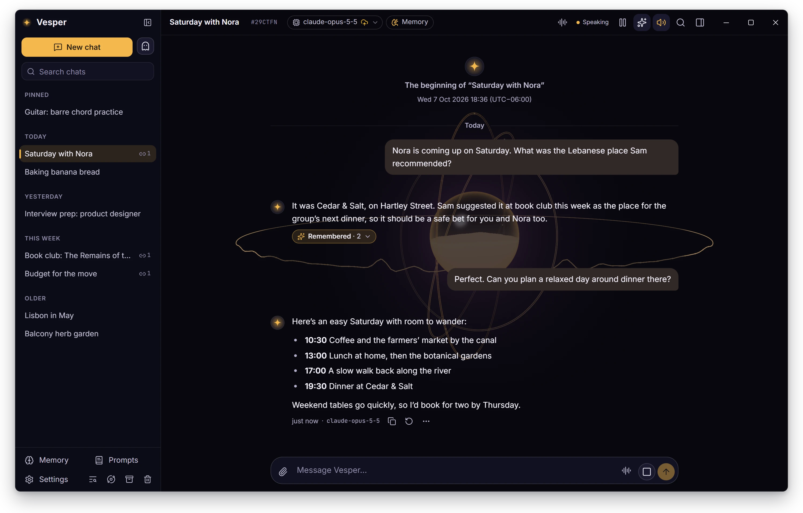
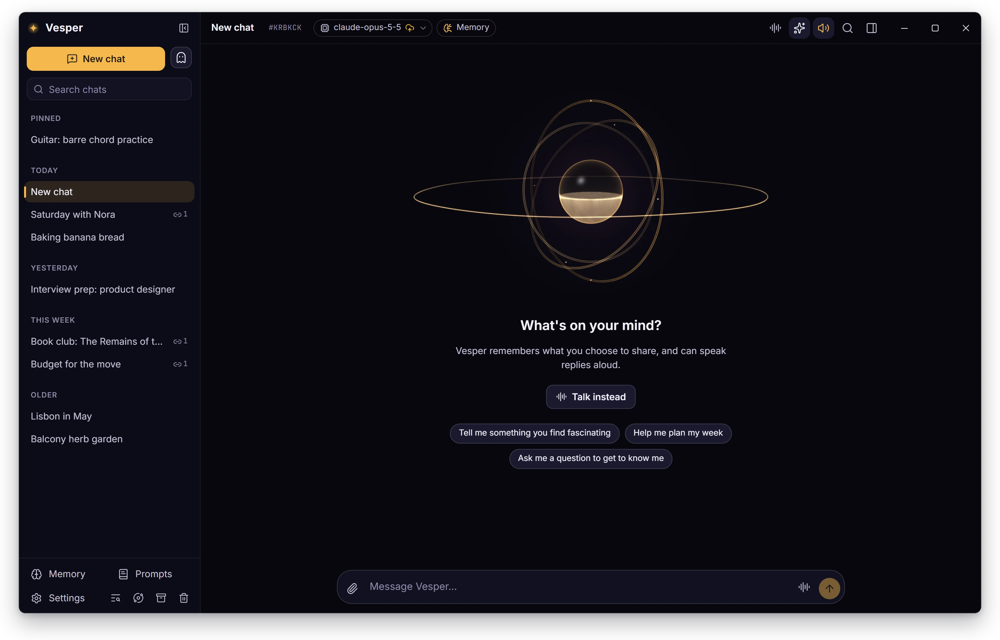
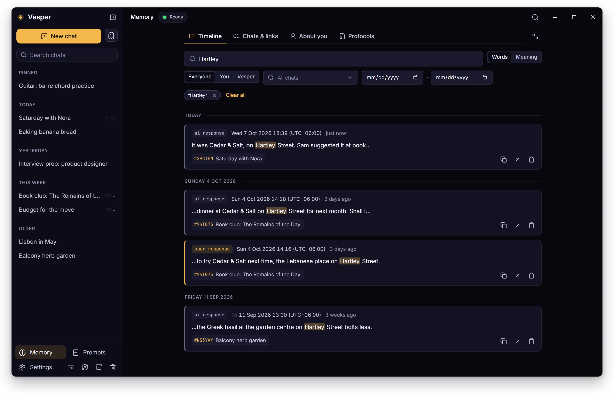
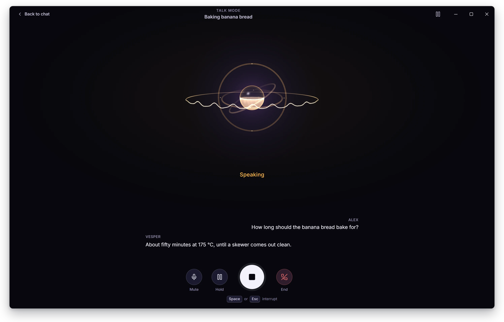
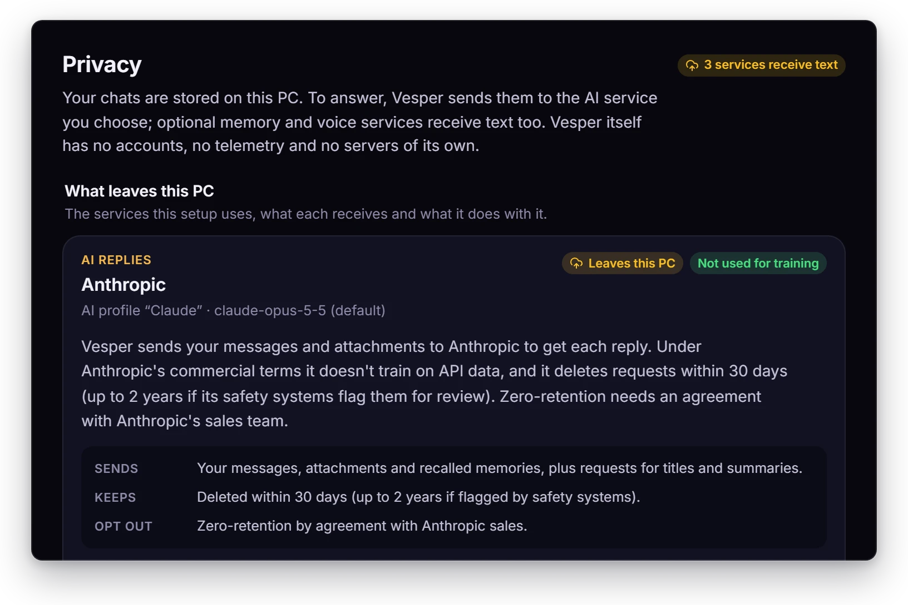
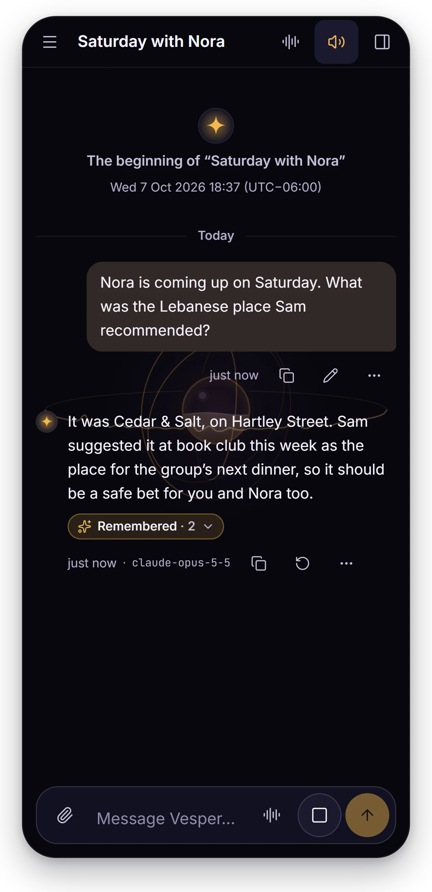
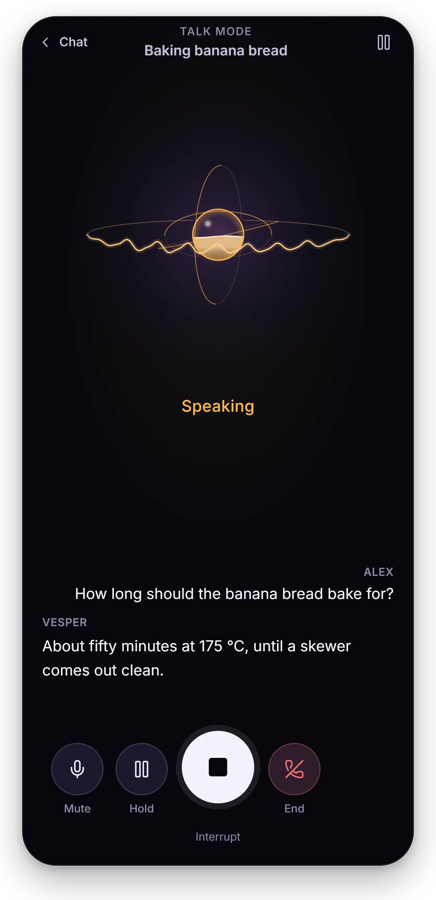
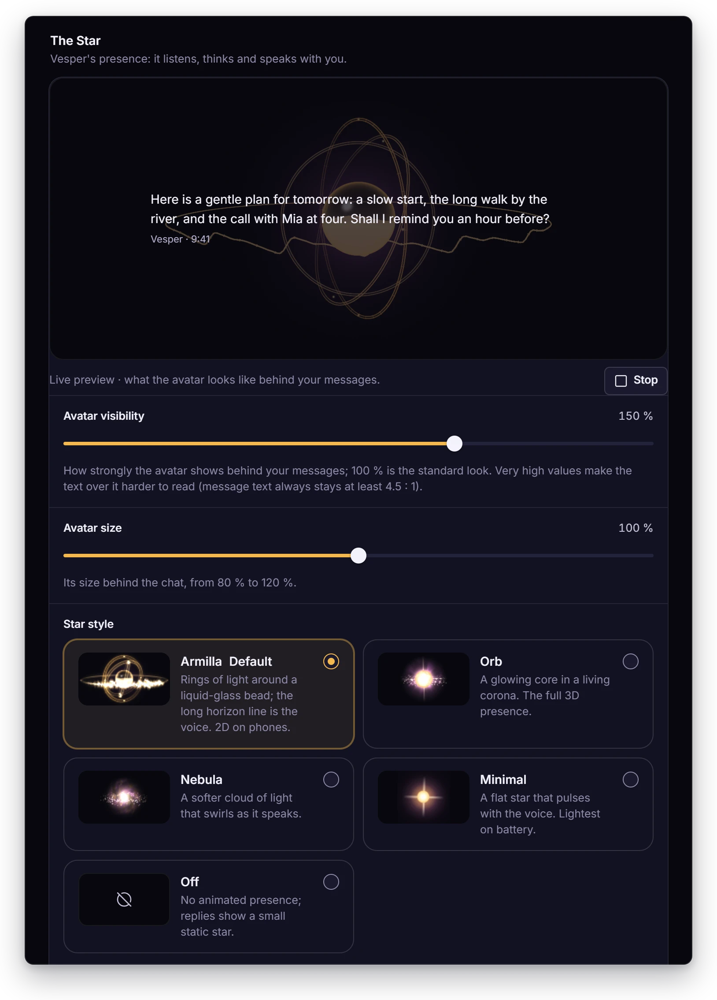
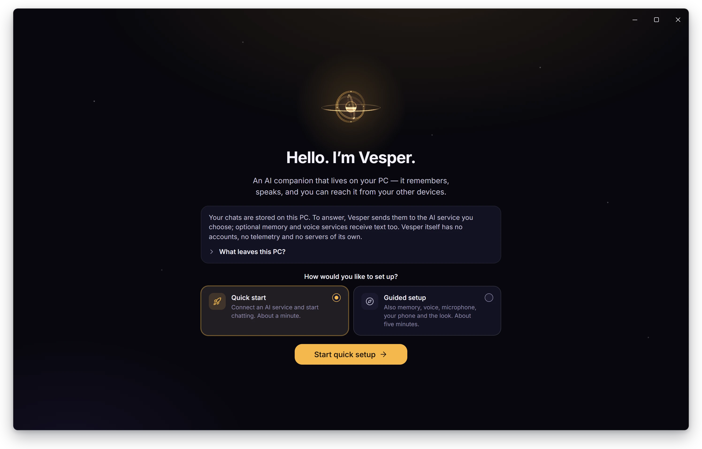

<p align="center">
  
</p>

<h1 align="center">Vesper</h1>

<p align="center">
  <b>An AI companion that lives on your PC.</b><br>
  Bring your own AI key. Vesper remembers, speaks and listens, and keeps your data on your computer.
</p>

<p align="center">
  <a href="https://github.com/skyehosting/vesper/releases/latest"></a>
  <a href="LICENSE"></a>
  <a href="#install"></a>
</p>

<p align="center">
  <a href="https://github.com/skyehosting/vesper/releases/latest"></a>
</p>

<p align="center">
  <a href="docs/GUIDE.md">User guide</a>
  &nbsp;&middot;&nbsp;
  <a href="#privacy">Privacy</a>
  &nbsp;&middot;&nbsp;
  <a href="CONTRIBUTING.md">Contributing</a>
</p>

<br>



## Why Vesper

- **Private by default.** Chats, memory, settings and keys stay on your PC. No accounts, no telemetry, and the one
  thing Vesper asks on its own is whether a new version is out (see [Updates](#updates)).
- **Your AI, your key.** OpenAI, Anthropic, Gemini, OpenRouter, Ollama and more, or any OpenAI-compatible address.
- **It remembers.** Every message, across every chat, searchable by word or by meaning.
- **It speaks and listens.** Voiced replies with the words appearing as they're spoken; speech recognition runs on your
  PC.
- **It has a presence.** A slowly turning sphere of light shows when Vesper is listening, thinking or speaking.
- **On your phone too.** Any browser on your home network, or anywhere through Tailscale.
- **Free and open source,** under the GNU GPL, version 3 or later.

## A closer look

### The presence

Armilla, the default presence, is a few rings of light turning around a glass bead. When Vesper speaks, its horizon
line becomes an oscilloscope of the real audio and rises and falls in place with the voice; when you speak, it shows
yours. In a conversation it steps back behind the messages.



### Memory

Every message is kept with its time and its chat, and the AI can search and recall it. The memory viewer searches
everything by word, or by meaning once "Remember with Voyage AI" is on, and shows when and where each match was said.
Import your ChatGPT and Claude exports, and memory works from day one.



### Talk mode

For a hands-free conversation, Talk mode (`/talk`, or the sound-waves button in the top bar) shows the presence full
size with live captions of both sides. Press <kbd>Space</kbd> to send what you said or to interrupt, and <kbd>Esc</kbd>
to interrupt or end. Speech recognition runs on your PC; cloud speech services are optional.



### Privacy

Settings → Privacy shows every service your setup sends text to, what each one receives, how long it keeps it and
whether it trains on it. **Private** chats are never sent to Voyage AI or recalled in other chats. **Temporary** chats
are never saved, added to memory or exported (the AI service you use still receives their messages).

<p align="center">
  
</p>

### On your phone

Choose who can reach Vesper in Settings → Access & security: "This PC only" (the default), "Local network" for
devices on your Wi‑Fi, or "Anywhere, with Tailscale". Set a password first, then scan the QR code Vesper shows. Phones
draw the presence in 2D.

<p align="center">
  
  &nbsp;&nbsp;
  
</p>

### Make it yours

Settings → Presence & appearance previews the presence live. Choose Armilla, orb, nebula, a flat 2D star or none, set
how visible and how large it is, and pick a dark, light or system theme with one of five accents. Voices come from
ElevenLabs, OpenAI, any OpenAI-compatible voice server, or the Windows voices (free and offline).

<p align="center">
  
</p>

### Chats and commands

Chats are grouped by day, and each one has a short ID like `#K7Q2MX`. Type `/` for commands: `/continue #K7Q2MX` picks
up where that chat left off, `/link` lets one chat remember another and `/remember` pins a fact every chat knows. Drop
in images, PDFs, Word documents, text or code: the AI reads the text in documents, and sees images when its model can.

## Install

Download one of two files from the [latest release](https://github.com/skyehosting/vesper/releases/latest). Vesper runs
on Windows 10 and 11 (64-bit).

- **Installer (recommended)**: `Vesper-Setup-<version>.exe`. Installs for your Windows account ("Only for me", no
  admin prompt), lets you choose the folder, can start Vesper with Windows and offers Local network access.
- **Portable**: `Vesper-<version>-portable.exe`. Runs without installing, but can't start with Windows or offer Local
  network access. Tailscale works in both.

Vesper isn't code-signed, so the first time you run it Windows SmartScreen may say "Windows protected your PC". Choose
**More info → Run anyway**.

The setup wizard opens on the first launch. **Quick start** takes about a minute: pick your AI service, paste its key
("Test connection" checks it) and choose a model. The [guide](docs/GUIDE.md#first-run) covers everything else.

<p align="center">
  
</p>

### Updates

The installed version keeps itself up to date. About 30 seconds after it starts, and then every hour, it asks GitHub
whether a newer version is out; by default a new version downloads in the background and installs the next time
Vesper closes. Settings → About → Updates sets how often it checks and what happens. The portable exe only checks.

Update checks contact GitHub (github.com and its download servers): they see your IP address and Vesper's version.
Nothing else is sent: no chats, settings or keys. Turn checks off in Settings → About.

## Documentation

- **[User guide](docs/GUIDE.md)**: [first run](docs/GUIDE.md#first-run), [using Vesper](docs/GUIDE.md#using-vesper),
  [other devices](docs/GUIDE.md#other-devices), [your data](docs/GUIDE.md#your-data),
  [updates](docs/GUIDE.md#updates) and [troubleshooting](docs/GUIDE.md#troubleshooting).
- **For developers**: [architecture](docs/02-ARCHITECTURE.md), [data and API](docs/03-DATA-AND-API.md),
  [design system](docs/04-DESIGN-SYSTEM.md), [testing](docs/05-TESTING.md) and the authoritative
  [decisions](docs/07-AMENDMENTS.md).

## Contributing

Pull requests are welcome. To build from source you need Node 24 and Windows 10/11 x64:

```bash
npm install
npm run dev
```

`npm run dev` starts the desktop app with live reload. [CONTRIBUTING.md](CONTRIBUTING.md) covers the test suites and
what CI checks, and the guide's [developer commands](docs/GUIDE.md#for-developers) list every script.

## License

Vesper is free software under the [GNU General Public License](LICENSE), version 3 or (at your option) any later
version. Third-party licenses are listed in `THIRD_PARTY_NOTICES.txt` (next to `Vesper.exe`, and in Settings → About).
